# AI Resume Screening and Scoring Tool

is directly into your README.md and replace the GitHub link if needed.

# 🤖 AI Resume Screener

> An AI-powered Resume Screening application that compares a candidate's resume with a Job Description (JD), calculates an ATS (Applicant Tracking System) compatibility score, identifies missing skills, analyzes qualifications, and provides personalized recommendations.


## 🌐 Live Demo

🔗 **Application:** https://ai-resume-screener-bwmak2hlgambjdswypsbjf.streamlit.app


# 📖 Overview

Recruiters often receive hundreds of resumes for a single job opening. Manually reviewing each resume is time-consuming and inconsistent.

The **AI Resume Screener** automates the initial screening process by extracting resume content, identifying technical skills and educational qualifications, comparing them with the job description, and calculating an ATS compatibility score.

The application also highlights missing skills and suggests learning recommendations to improve the candidate's resume.


# ✨ Features

✅ Upload Resume (PDF)

✅ Paste Job Description

✅ Automatic Resume Text Extraction

✅ Resume Text Cleaning

✅ Technical Skill Extraction

✅ Educational Qualification Detection

✅ ATS Compatibility Score

✅ Matched Skills Analysis

✅ Missing Skills Detection

✅ Qualification Matching

✅ Personalized Learning Recommendations

✅ Interactive Streamlit Dashboard


# 🛠️ Tech Stack

| Category | Technologies |
|----------|--------------|
| Language | Python |
| Framework | Streamlit |
| PDF Parsing | PyMuPDF (fitz) |
| Text Processing | Regular Expressions (Regex) |
| Version Control | Git & GitHub |

# 📂 Project Structure

```text
AI-Resume-Screener
│
├── streamlit_app.py
├── app.py                  # CLI Testing Version
├── requirements.txt
│
├── parser
│   └── pdf_parser.py
│
├── preprocessing
│   └── text_cleaner.py
│
├── extractor
│   ├── skills.py
│   └── Qualification.py
│
├── similarity
│   └── score.py
│
├── recommadation
│   └── recommadate.py
│
├── resumes
├── job_description
└── README.md


# ⚙️ How It Works

```text
Upload Resume (PDF)
        │
        ▼
Extract Resume Text
        │
        ▼
Clean Resume Text
        │
        ▼
Extract Skills
        │
        ▼
Extract Qualification
        │
        ▼
Process Job Description
        │
        ▼
Compare Resume & JD
        │
        ▼
Calculate ATS Score
        │
        ▼
Generate Recommendations
```

---

# 📊 ATS Score Calculation

The ATS score is calculated by comparing the skills extracted from the resume with the skills found in the Job Description.

```text
ATS Score = (Matched Skills / Total Job Skills) × 100
```

The application displays:

- Overall ATS Score
- Matched Skills
- Missing Skills
- Qualification Match Status
- Personalized Recommendations


# 🎓 Qualification Analysis

The application detects educational qualifications from both:

- Resume
- Job Description

Supported qualifications include:

- B.Tech
- B.E.
- BCA
- MCA
- B.Sc
- M.Tech
- Bachelor's Degree
- Master's Degree

The application indicates whether the candidate's qualification matches the job requirements.

# 📚 Recommendations

For every missing skill identified in the Job Description, the application generates personalized learning recommendations.

Example:

```
Learn Docker
Learn Kubernetes
Learn AWS


# 📷 Screenshots
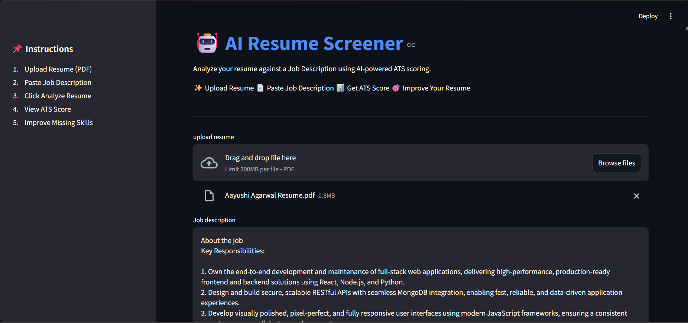
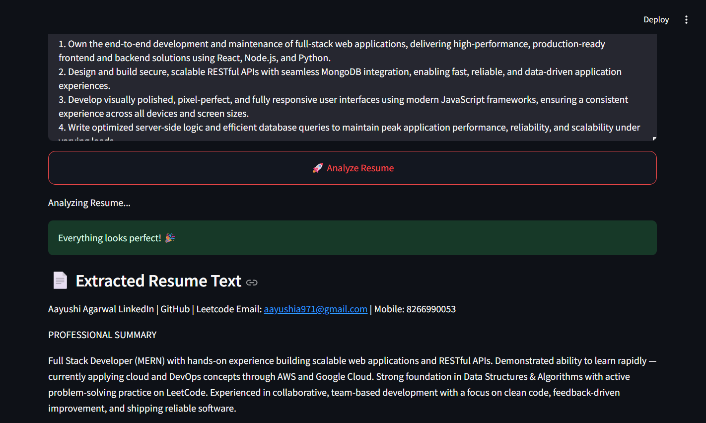
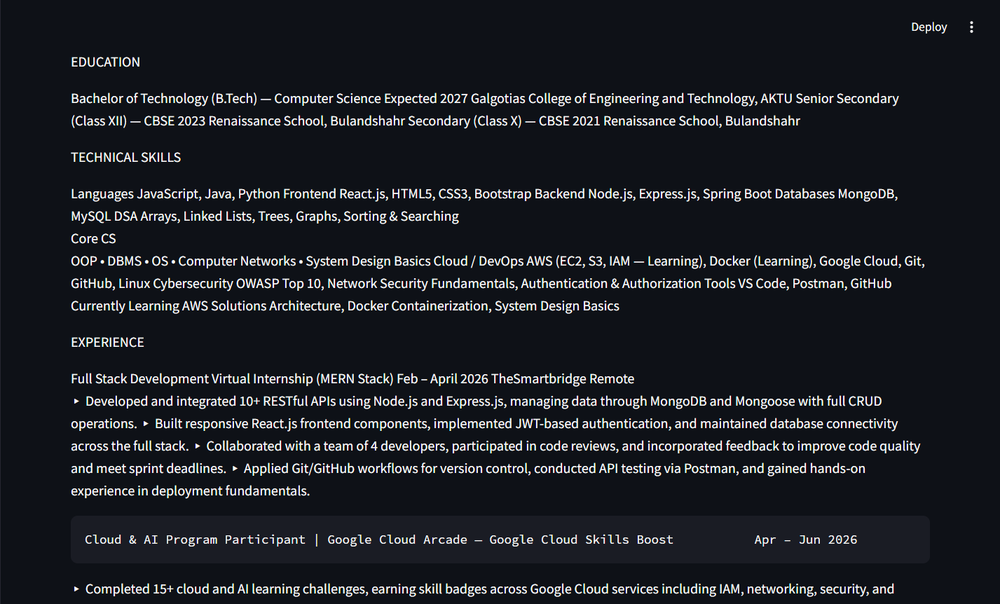
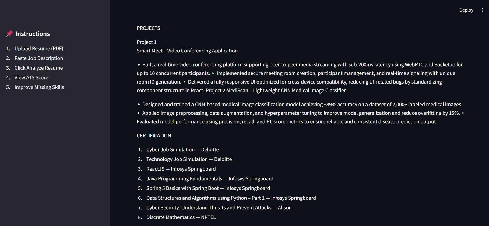
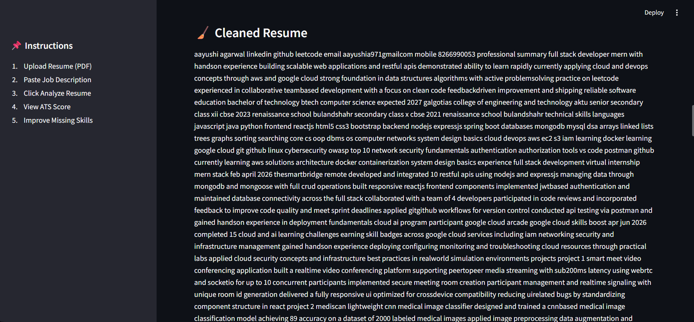
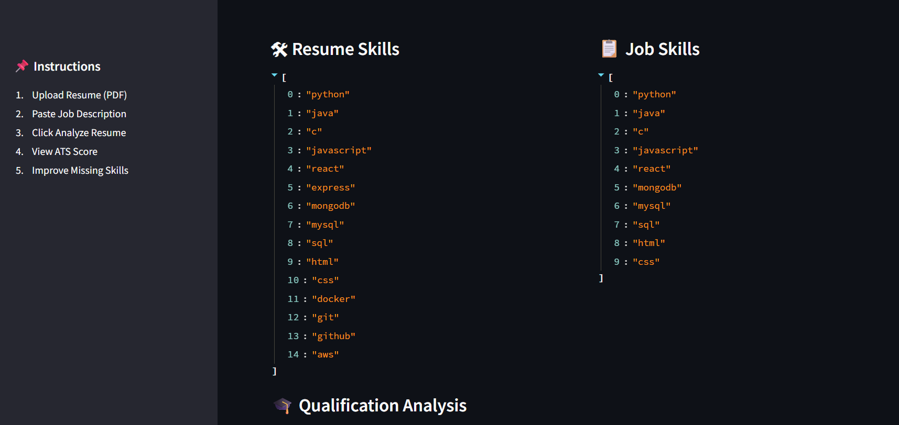
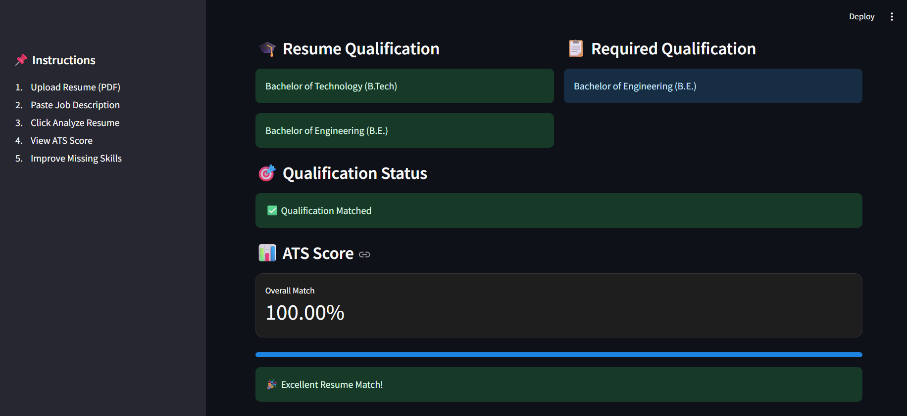
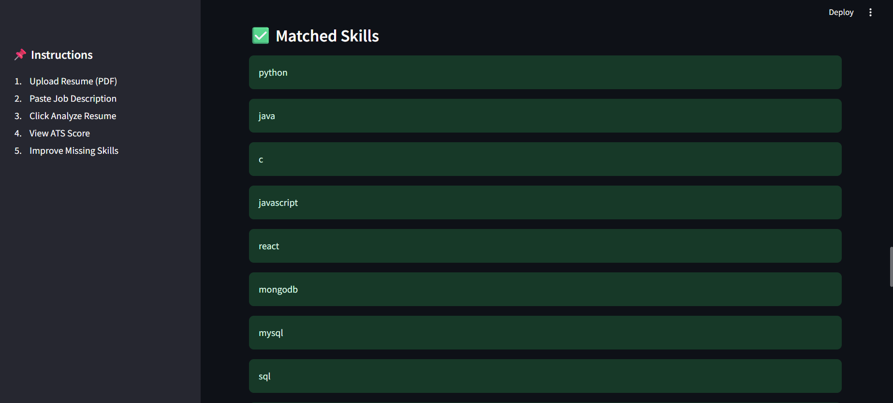
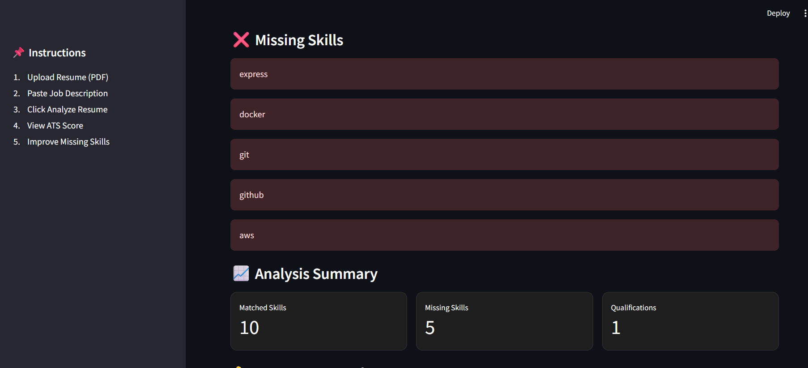
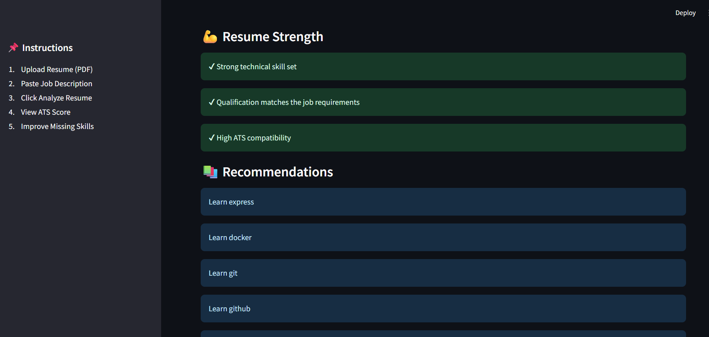
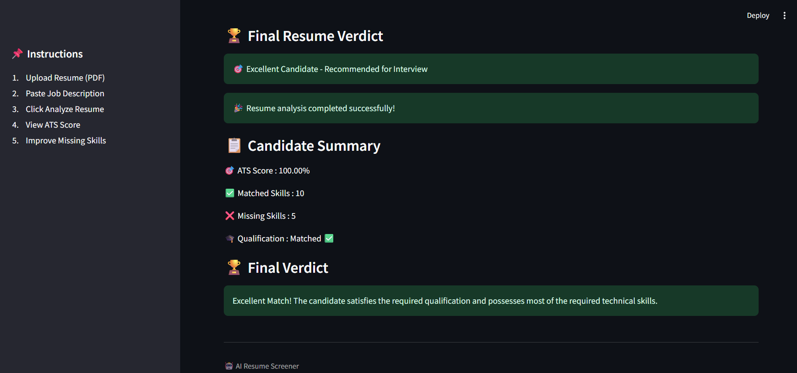

# 🚀 Getting Started

## Clone Repository

```bash
git clone https://github.com/Aayushi-Agarwal123/AI-Resume-Screener.git
```

## Move to Project Folder

```bash
cd AI-Resume-Screener
```

## Install Dependencies

```bash
pip install -r requirements.txt
```

## Run the Application

```bash
streamlit run streamlit_app.py
```


# 📈 Prototype Results

The developed prototype successfully:

- Extracts text from PDF resumes.
- Detects technical skills.
- Detects educational qualifications.
- Compares resume skills with job requirements.
- Calculates ATS compatibility score.
- Highlights matched and missing skills.
- Generates personalized recommendations.
- Provides an interactive and easy-to-use interface.


# ⚠️ Limitations

- Supports PDF resumes only.
- Uses keyword-based skill extraction.
- Does not understand semantic similarity.
- Does not evaluate soft skills.
- Basic qualification matching.
- Experience level analysis is limited.
- Images inside resumes are ignored.


# 🚀 Future Enhancements

- Multiple Resume Comparison
- Resume Ranking Dashboard
- AI-powered Resume Suggestions
- Experience Matching
- Certification Analysis
- Resume PDF Report Generation
- DOCX Resume Support
- Recruiter Dashboard
- Job Description URL Analysis
- NLP-based Skill Matching
- Candidate Ranking System


# 👩‍💻 Author

**Aayushi Agarwal**

B.Tech Computer Science Engineering


---

# 📄 License

This project is developed for educational and internship purposes.

---

## ⭐ If you found this project useful, consider giving it a Star on GitHub!
